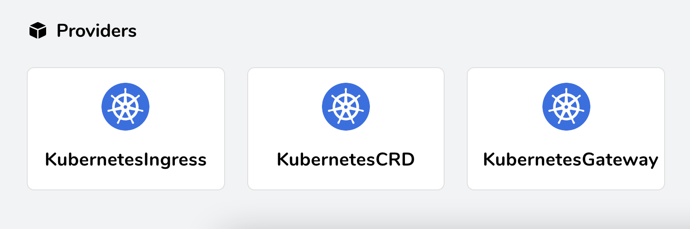

# Getting Started with Traefik and the New Kubernetes Service APIs

[SOME IMAGE?]

It was in June of last year that we [first discussed](https://traefik.io/blog/kubernetes-ingress-service-api-demystified/) the movement inside the Kubernetes community to develop an improved method of defining and managing ingress traffic for Kubernetes. That effort bore fruit in the form of the new [Service APIs](https://kubernetes-sigs.github.io/service-apis/).

We introduced initial support for the Service APIs in [Traefik 2.4](https://traefik.io/blog/announcing-traefik-2-4/) in January. This post will demonstrate how to use the new Gateway, GatewayClass, and HTTPRoute APIs with Traefik to route requests to services.

## Prerequisites

Of course, you'll need some things before you begin:

* A working Kubernetes cluster, which this guide assumes is running on `localhost`
* The `kubectl` command-line tool, installed and configured to access your cluster

You **do not** need to have Traefik installed on your cluster before you begin. You'll take care of that in the next few steps.

You'll also want the set of configuration files that accompanies this post, which are available on GitHub. Clone the repository like so:

``` bash
git clone https://github.com/traefik-tech-blog/k8s-service-apis
```

### Installing the CRDs

At the present time, the Service APIs are not installed on Kubernetes clusters by default. Support for them depends upon a set of custom resource definitions (CRDs), and you should make sure these are installed before enabling support in Traefik.

It's a safe bet to use the current released version, 0.10:

``` bash
kubectl apply -k "github.com/kubernetes-sigs/service-apis/config/crd?ref=v0.1.0"
```

### Install and Configure Traefik to Use Service APIs

To install Traefik v2.4 (or later) and have it configured to enable the new provider, the best way is to use the official Helm chart:

``` bash
helm repo add traefik https://helm.traefik.io/traefik
helm repo update
helm install traefik --set experimental.kubernetesGateway.enabled=true traefik/traefik
```

Note the `--set experimental.kubernetesGateway.enabled=true` flag. This will install Traefik 2.4, enable the new Service APIs provider, and also create GatewayClasses and a Gateway instance.

More customization options for the installation, such as the label selector or TLS certificates (which you'll use later in this demonstration) are visible in the Helm chart's [values file](https://github.com/traefik/traefik-helm-chart/blob/master/traefik/values.yaml).


To verify that the new features are enabled, use port forwarding to expose the Traefik dashboard:

``` bash
kubectl port-forward $(kubectl get pods --selector "app.kubernetes.io/name=traefik" --output=name) 9000:9000
```

 When you use your browser to access the dashboard via `http://localhost:9000/dashboard/`, you should see that the KubernetesGateway provider is activated and ready to serve:



## Setup a Dummy Service

You'll need a target where Traefik can route requests, so quickly install the famous whoami service using `kubectl apply -f`, in order to have something to use for testing purposes:

``` yaml
# 01-whoami.yaml
---
kind: Deployment
apiVersion: apps/v1
metadata:
  name: whoami

spec:
  replicas: 2
  selector:
    matchLabels:
      app: whoami
  template:
    metadata:
      labels:
        app: whoami
    spec:
      containers:
        - name: whoami
          image: traefik/whoami:v1.6.0
          ports:
            - containerPort: 80
              name: http

---
apiVersion: v1
kind: Service
metadata:
  name: whoami

spec:
  ports:
    - protocol: TCP
      port: 80
      targetPort: http
  selector:
    app: whoami

```

## Deploying a Simple Host

Now that everything is setup, you're ready to start the action the Service APIs way. Where previously you would have created an Ingress or IngressRoute, here you'll deploy your first simple HTTPRoute:

``` yaml
# 02-whoami-httproute.yaml  
---
kind: HTTPRoute
apiVersion: networking.x-k8s.io/v1alpha1
metadata:
  name: http-app-1
  namespace: default
  labels:
    app: traefik
spec:
  hostnames:
    - "whoami"
  rules:
    - matches:
        - path:
            type: Exact
            value: /
      forwardTo:
        - serviceName: whoami
          port: 80
          weight: 1
```

This HTTPRoute will catch requests made to the `whoami` hostname and forward them to the whoami service you deployed earlier. If you now make a request for that hostname, you will see typical whoami output, which looks something like this:

``` bash
curl -H "Host: whoami" http://localhost
Hostname: whoami-9cdc57b6d-pfpxs
IP: 127.0.0.1
IP: ::1
IP: 10.42.0.13
IP: fe80::9c1a:a1ff:fead:2663
RemoteAddr: 10.42.0.11:33658
GET / HTTP/1.1
Host: whoami
User-Agent: curl/7.64.1
Accept: */*
Accept-Encoding: gzip
X-Forwarded-For: 10.42.0.1
X-Forwarded-Host: whoami
X-Forwarded-Port: 80
X-Forwarded-Proto: http
X-Forwarded-Server: traefik-74d7f586dd-xxr7r
X-Real-Ip: 10.42.0.1

```

Pay attention to the `app: traefik` label selector, which ensures that requests are routed to your Traefik instance. This is the default label that is set during the installation phase described above, but it can also be customized via the Helm chart.

## Simple Host with Paths

The example above can easily be enhanced to only react on a given subpath:

``` yaml
# 03-whoami-httproute-paths.yaml
--- 
apiVersion: networking.x-k8s.io/v1alpha1
kind: HTTPRoute
metadata: 
  labels: 
    app: traefik
  name: http-app-1
  namespace: default
spec: 
  hostnames: 
    - whoami
  rules: 
    - 
      forwardTo: 
        - 
          port: 80
          serviceName: whoami
          weight: 1
      matches: 
        - 
          path: 
            type: Exact
            value: /foo
```

With the modified HTTPRoute, you'll see that the previous request now returns a 404 error, while requesting the `/foo` path suffix returns success:

``` bash
curl -H "Host: whoami" http://localhost/foo
Hostname: whoami-9cdc57b6d-pfpxs
IP: 127.0.0.1
IP: ::1
IP: 10.42.0.13
IP: fe80::9c1a:a1ff:fead:2663
RemoteAddr: 10.42.0.11:34424
GET /foo HTTP/1.1
Host: whoami
User-Agent: curl/7.64.1
Accept: */*
Accept-Encoding: gzip
X-Forwarded-For: 10.42.0.1
X-Forwarded-Host: whoami
X-Forwarded-Port: 80
X-Forwarded-Proto: http
X-Forwarded-Server: traefik-74d7f586dd-xxr7r
X-Real-Ip: 10.42.0.1
```

More information about what parts of a request can be matched can be found in the [official Service API documentation](https://kubernetes-sigs.github.io/service-apis/httproute/).

## TLS with Static Certificates

So far, you have created a simple HTTPRoute. For the next step, you'll want to secure this route through TLS. For that, you need to create a Kubernetes Secret first with a dummy certificate. You'll find one included in the configuration files in this post's GitHub repository:


``` yaml
# 04-tls-dummy-cert.yaml
--- 
apiVersion: v1
data: 
  tls.crt: LS0tLS1CRUdJTiBDRVJUSUZJQ0FURS0tLS0tCk1JSUVVVENDQXJtZ0F3SUJBZ0lRV2pNZ2Q4OUxOUXIwVC9WMDdGR1pEREFOQmdrcWhraUc5dzBCQVFzRkFEQ0IKaFRFZU1Cd0dBMVVFQ2hNVmJXdGpaWEowSUdSbGRtVnNiM0J0Wlc1MElFTkJNUzB3S3dZRFZRUUxEQ1JxWW1SQQpaSEpwZW5wMElDaEtaV0Z1TFVKaGNIUnBjM1JsSUVSdmRXMWxibXB2ZFNreE5EQXlCZ05WQkFNTUsyMXJZMlZ5CmRDQnFZbVJBWkhKcGVucDBJQ2hLWldGdUxVSmhjSFJwYzNSbElFUnZkVzFsYm1wdmRTa3dIaGNOTWpBeE1qQTAKTVRReE1qQXpXaGNOTWpNd016QTBNVFF4TWpBeldqQllNU2N3SlFZRFZRUUtFeDV0YTJObGNuUWdaR1YyWld4dgpjRzFsYm5RZ1kyVnlkR2xtYVdOaGRHVXhMVEFyQmdOVkJBc01KR3BpWkVCa2NtbDZlblFnS0VwbFlXNHRRbUZ3CmRHbHpkR1VnUkc5MWJXVnVhbTkxS1RDQ0FTSXdEUVlKS29aSWh2Y05BUUVCQlFBRGdnRVBBRENDQVFvQ2dnRUIKQU12bEc5d0ZKZklRSWRreDRXUy9sNGhQTVRQcmVUdmVQOS9MZlBYK2h2ekFtVC90V1BJbGxGY2JJNnZzemp0NQpEWlZUMFFuQzhHYzg0K1lPZXZHcFpNaTg0M20zdTdFSUlmY3dETUF4WWQ0ZjJJcENLVW9jSFNtVGpOaVhDSnhwCjVNd2tlVXdEc1dvVVZza1RxeVpOcWp0RWVIbGNuQTFHaGZSa3dEUkZxd1QxeVhaUTBoZHpkQzRCeFhhaVk0VEQKaFQ1dnFXQmlnUlh0M1VwSkhEL1NXUG4wTEVQOHM3ckhjUkZPY0RhV3ZWMW1jTkxNZUpveWNYUTJ0M2Z1Q0Fsegp3UWZOSjFQSk45QWlLalFJcXJ1MGFnMC9wU0kyQ3NkbEUzUTFpM29tZGpCQkZDcmxNMTZyY0wwNDdtWXZKOEVvCjFMdDVGQkxnVURBZktIOFRsaXU0ZG9jQ0F3RUFBYU5wTUdjd0RnWURWUjBQQVFIL0JBUURBZ1dnTUJNR0ExVWQKSlFRTU1Bb0dDQ3NHQVFVRkJ3TUJNQXdHQTFVZEV3RUIvd1FDTUFBd0h3WURWUjBqQkJnd0ZvQVV5cWNiZGhDego3Nm4xZjFtR3BaemtNb2JOYnJ3d0VRWURWUjBSQkFvd0NJSUdkMmh2WVcxcE1BMEdDU3FHU0liM0RRRUJDd1VBCkE0SUJnUUFzWlBndW1EdkRmNm13bXR1TExkWlZkZjdYWk13TjVNSkk5SlpUQ1NaRFRQRjRsdG91S2RCV0gxYm0Kd003VUE0OXVWSHplNVNDMDNlQ294Zk9Ddlczby94SFZjcDZGei9qSldlYlY4SWhJRi9JbGNRRyszTVRRMVJaVApwNkZOa3kvOEk3anF1R2V2b0xsbW9KamVRV2dxWGtFL0d1MFloVCtudVBJY1pGa0hsKzFWOThEUG5WaTJ3U0hHCkIwVU9RaFdxVkhRU0RzcjJLVzlPbmhTRzdKdERBcFcwVEltYmNCaWlXOTlWNG9Ga3VNYmZQOE9FTUY2ZXUzbW0KbUVuYk1pWFFaRHJUMWllMDhwWndHZVNhcTh1Rk82djRwOVVoWHVuc3Vpc01YTHJqQzFwNmlwaDdpMTYwZzRWawpmUXlYT09KY0o2WTl2a2drYzRLYUxBZVNzVUQvRDR1bmd6emVWQ3k0ZXhhMmlBakpzVHVRS3JkOFNUTGNNbUJkCnhtcXVKZXFWSEpoZEVMNDBMVGtEY1FPM1NzOUJpbjRaOEFXeTJkdkR1a1gwa084dm9IUnN4bWVKcnVyZ09MVmIKamVvbTVQMTVsMkkwY3FKd2lNNHZ3SlBsb25wMTdjamJUb0IzQTU5RjZqekdONWtCbjZTaWVmR3VLM21hVWdKegoxWndjamFjPQotLS0tLUVORCBDRVJUSUZJQ0FURS0tLS0t
  tls.key: LS0tLS1CRUdJTiBQUklWQVRFIEtFWS0tLS0tCk1JSUV2Z0lCQURBTkJna3Foa2lHOXcwQkFRRUZBQVNDQktnd2dnU2tBZ0VBQW9JQkFRREw1UnZjQlNYeUVDSFoKTWVGa3Y1ZUlUekV6NjNrNzNqL2Z5M3oxL29iOHdKay83Vmp5SlpSWEd5T3I3TTQ3ZVEyVlU5RUp3dkJuUE9QbQpEbnJ4cVdUSXZPTjV0N3V4Q0NIM01BekFNV0hlSDlpS1FpbEtIQjBwazR6WWx3aWNhZVRNSkhsTUE3RnFGRmJKCkU2c21UYW83UkhoNVhKd05Sb1gwWk1BMFJhc0U5Y2wyVU5JWGMzUXVBY1Yyb21PRXc0VStiNmxnWW9FVjdkMUsKU1J3LzBsajU5Q3hEL0xPNngzRVJUbkEybHIxZFpuRFN6SGlhTW5GME5yZDM3Z2dKYzhFSHpTZFR5VGZRSWlvMApDS3E3dEdvTlA2VWlOZ3JIWlJOME5ZdDZKbll3UVJRcTVUTmVxM0M5T081bUx5ZkJLTlM3ZVJRUzRGQXdIeWgvCkU1WXJ1SGFIQWdNQkFBRUNnZ0VCQUl5SWpvbzQxaTJncHVQZitIMkxmTE5MK2hyU0cwNkRZajByTVNjUVZ4UVEKMzgvckZOcFp3b1BEUmZQekZUWnl1a1VKYjFRdUU2cmtraVA0S1E4MTlTeFMzT3NCRTVIeWpBNm5CTExYbHFBVwpEUmRHZ05UK3lhN2xiemU5NmdaOUNtRVdackJZLzBpaFdpdmZyYUNKK1dJK1VGYzkyS1ZoeldSa3FRR2VYMERiCnVSRXRpclJzUXVRb1hxNkhQS1FIeUVITHo2aWVVMHJsV3IyN0VyQkJ4RlRKTm51MnJ1MHV1Ly8wdG1SYjgzZWwKSUpXQnY1V1diSnl4dXNnMkhkc0tzTUh0eEVaYWh1UlpTNHU2TURQR3dSdjRaU0xpQm1FVVc3RUMwUEg3dCtGaAoxUDcrL0Yyd1pGSDAvSzl6eXUyc0lOMDJIbTBmSWtGejBxb09BSzQ5OXhrQ2dZRUE2SC9nVUJoOG9GUSt2cmZKCnQvbXdMeFBHZHhWb3FWR1hFVjhlQzNWbmxUSXJlREpNWm81b1hKZHNuQ0d2S1NaWUhXZ3o3SVpwLzRCL29vSWsKTDl4TEJSVTJwS0d1OGxBT1ZhYnpaVDk0TTZYSE1PTGQ0ZlUrS3ZqK1lLVm5laEM3TVNQL3RSOWhFMjN1MnRKZwp1eUdPRklFVlptNHZxS1hEelU3TTNnU0R5WXNDZ1lFQTRJRVFyZDl2MXp0T2k5REZ6WEdnY05LVmpuYmFTWnNXCm9JNm1WWFJZS1VNM1FyWUw4RjJTVmFFM0Y0QUZjOXRWQjhzV0cxdDk4T09Db0xrWTY2NjZqUFkwMXBWTDdXeTMKZXpwVEFaei9tRnc2czdic3N3VEtrTW5MejVaNW5nS3dhd3pRTXVoRGxLTmJiUi90enRZSEc0NDRrQ2tQS3JEbQphOG40bUt6ZlRuVUNnWUFTTWhmVERPZU1BS3ZjYnpQSlF6QkhydXVFWEZlUmtNSWE2Ty9JQThzMGdQV245WC9ICk12UDE4eC9iNUVMNkhIY2U3ZzNLUUFiQnFVUFQ2dzE3OVdpbG9EQmptQWZDRFFQaUxpdTBTOUJUY25EeFlYL3QKOUN5R1huQkNEZy9ZSE1FWnFuQ1RzejM4c0VqV05VcSt1blNOSkVFUmdDUVl0Y2hxSS9XaWxvWGQyd0tCZ1FEQworTlBYYlBqZ1h5MHoxN2d4VjhFU3VwQVFEY0E5dEdiT1FaVExHaU9Ha2sxbnJscG9BWnVZcWs0Q0pyaVZpYUlyCkJvREllWWpDcjVNK3FnR3VqU3lPUnpSVU40eWRRWkdIZjN1Zkp3NEM3L1k3SlY0amlzR3hSTSt3Rk9yQ0EydmIKVEdGMEZLcThaN0o2N3dQRVliUUNobDB4TmJkcVIvK1ZGTzdGQ1QxV0VRS0JnQThUaE9hZmNEUmdpd0IxRFdyRgozZ1lmT3I0dERENExrNjRYZlF6ajdtRXQyYlJzOFNEYXYwVGZPclVUUlpFTTkyTVFZMnlrbzhyMDJDbmpndmxCCm1aYnZCTEFYaVZLa0laai9TTkNYUnhzOFZkZ3psTkpzYVNZTUtsNloxK1Z3MnZUdDNQSnI0TXlhRWpHYUxlSmMKRGRTQjdYOU9ESk5acW10bGpoRzc5eXpQCi0tLS0tRU5EIFBSSVZBVEUgS0VZLS0tLS0=
kind: Secret
metadata: 
  name: mysecret
  namespace: default
type: kubernetes.io/tls
```

With that secret in place, you can start securing. First, you must reconfigure the Gateway to create a TLS listener with `mysecret` certificate. You can achieve this by using the `upgrade` option with the Helm chart to add a `certificates` section to your Traefik configuration:

``` bash
helm upgrade traefik -f values.yaml traefik/traefik
```

``` yaml
# 05-values.yaml
--- 
experimental: 
  kubernetesGateway: 
    appLabelSelector: traefik
    certificates:
      - 
        group: "core"
        kind: "Secret"
        name: "mysecret"
    enabled: true
```

Once Traefik has restarted, you can check the results. The same HTTPRoute is still in effect, only now you can access it with HTTPS:

``` bash
curl --insecure -H "Host: whoami" https://localhost/foo
Hostname: whoami-9cdc57b6d-pfpxs
IP: 127.0.0.1
IP: ::1
IP: 10.42.0.13
IP: fe80::9c1a:a1ff:fead:2663
RemoteAddr: 10.42.0.11:53158
GET /foo HTTP/1.1
Host: whoami
User-Agent: curl/7.64.1
Accept: */*
Accept-Encoding: gzip
X-Forwarded-For: 10.42.0.1
X-Forwarded-Host: whoami
X-Forwarded-Port: 443
X-Forwarded-Proto: https
X-Forwarded-Server: traefik-74d7f586dd-xxr7r
X-Real-Ip: 10.42.0.1
```

Note that you must pass the `--insecure` parameter to `curl` in order to use the unsigned dummy certificate.

## Canary Releases

Another feature that Traefik 2.4 can support via the Service API specification is canary releases. Suppose you want to run two different services (or two versions of the same service) on one endpoint and route a portion of requests to each. You can achieve this by modifying your HTTPRoute.

First, you'll need a second service to run. For the sake of this example, you can quickly spawn an instance of Nginx:

``` yaml
# 06-nginx.yaml
---
kind: Deployment
apiVersion: apps/v1
metadata:
  name: nginx

spec:
  replicas: 2
  selector:
    matchLabels:
      app: whoami
  template:
    metadata:
      labels:
        app: nginx
    spec:
      containers:
        - name: whoami
          image: nginx
          ports:
            - containerPort: 80
              name: http

---
apiVersion: v1
kind: Service
metadata:
  name: whoami

spec:
  ports:
    - protocol: TCP
      port: 80
      targetPort: http
  selector:
    app: nginx
```

The HTTPRoute resource has a weight option, and you can assign different values to each of the two services:

``` yaml
# 07-whoami-nginx-canary.yaml
--- 
apiVersion: networking.x-k8s.io/v1alpha1
kind: HTTPRoute
metadata: 
  labels: 
    app: traefik
  name: http-app-1
  namespace: default
spec: 
  hostnames: 
    - whoami
  rules: 
    - 
      forwardTo: 
        - 
          port: 80
          serviceName: whoami
          weight: 3
        - 
          port: 80
          serviceName: nginx
          weight: 1

```

Now, you'll once again be able to access your whoami service at `http://localhost` (without the `foo/` path suffix), but 25% of the time you'll see a response from Nginx, rather than from whoami.

## Known Limitations and the Future

Currently, Traefik's implementation of the Service APIs is focused on HTTP and HTTPS only. However, the spec also features TCP and in the future it will probably support UDP, as well. These are features the Traefik team will be working on.

In the meantime, you can get started using the Kubernetes Service APIs with Traefik 2.4 today. Explore away, and be sure to share your feedback in the [community forums](https://community.traefik.io/c/traefik/).
